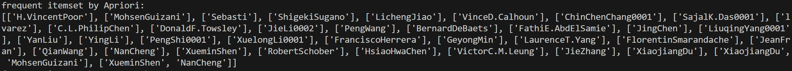
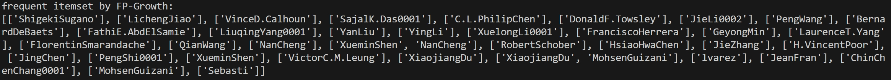
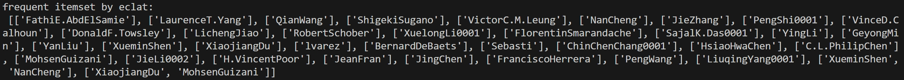
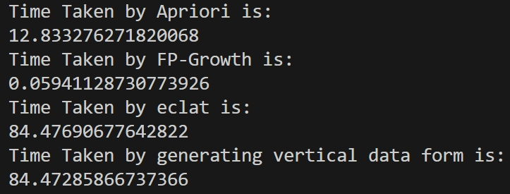

# 频繁模式挖掘

本次作业在DBLP数据集（10000条）上实现了三种频繁项集挖掘算法：(1)Apriori (2)FP-growth (3)ECLAT。
取支持度计数阈值为5。

## Apriori

由`Apriori_gen`实现候选k-项集的生成。对于两个有k-1项相同的频繁k-项集，合并它们生成新的(k+1)-项集。(与之类似的函数在eclat算法生成候选项集的过程中会再次用到。)由`Apriori_count_subset`实现对候选k-项集的支持度计数。由`Apriori_prune`实现对候选k-项集剪枝。

### 运行结果

## FPTree-Growth

`FPTree_uptransveral`函数自下而上的寻找以给定结点结尾的路径，`find_prefix_path`函数根据`FPTree_uptransveral`函数得到的路径得到以给定项或项集结尾的前缀路径集合，`create_FPTree`函数根据得到的前缀路径给出新的条件FP树，函数`Mine_Tree`递归地挖掘前缀路径集合与条件FP树。

### 运行结果

## ECLAT

`gen_fk`函数递归地生成频繁项集： 
    `f_tid`: 频繁项集与tidset的字典，数据结构{f_set:f_set} 
    `sup_dict`: 存储所有频繁项集的字典，键为频繁项集，值为支持度，数据结构{f_set:int} 
    `min_support_count`: 最小支持度计数 
    `return`: 频繁项集的支持度计数字典 

### 运行结果

## 结果分析

可以看到三种算法得到了相同的频繁模式挖掘结果，这是因为它们都是不重不漏的完备的挖掘算法。对运行时间进行测试，结果如下： 
 
从表面上看，FP增长算法所需的运行时间最短，这是因为和同样是在水平数据格式上挖掘的Apriori算法相比，FP增长算法通过两次扫描数据库建立了FP树的紧凑数据结构 ，避免了产生大量的候选项集，然后在不相交的子问题上进行分治。在这个问题中Eclat算法看似用时最长，实际上主要的时间用在将水平数据格式转化为垂直数据格式，真正的挖掘时间只有约0.004秒，比FP增长算法小1个数量级。 
这是因为在这个数据中，每个项的支持度计数都比较小，换言之，转化为垂直数据格式后，项集对应的TID集很短，因此能快速的进行TID集合交运算并减少大量候选项集。因此对于每个项支持度计数较小的数据集，eclat算法尤其优势。但在TID集较长，或者说项集的支持度计数较大的数据集中，长集合会占据大量内存，且交集计算需要很多时间，此时FP增长算法更有优势。

